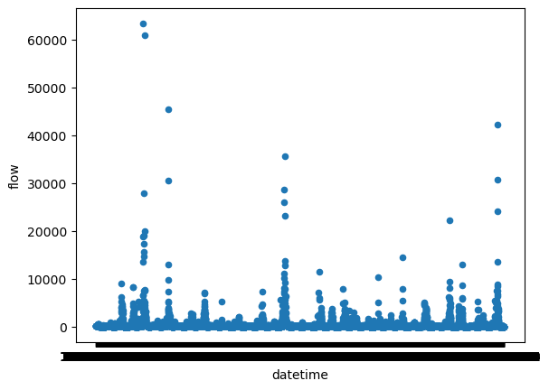
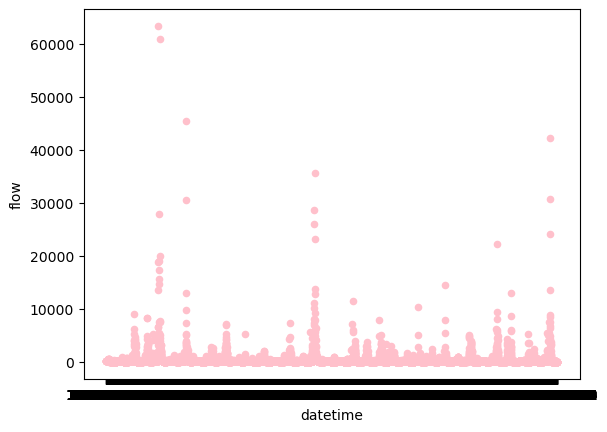

### Name: Jason Schlottman
## Date: 09/14/2023
## Assignent: HW_4 Numpy 

# Summary
"In order to generate my forecast values this week I used conditional statements with the numpy array  flow_data from the provided starter code. This produced 1-week and 2-week forecast estimstes of 225.171 cfs and 186.765 cfs for each period."

# Questions:
"1. In order to form astimates I utlized the flow_data numpy array which is essentially an array of flow over time. Given this i used conditionals to select desired points when flow fell withn a certain range. Then we observed the upper and lower quartiles of this dataset to determine upper and lower boundaries as well as returning a mean flow value across the points.
Histograms:

"
"2.  The variable flow_data is a numpy array. It is composed of time values including year, month, day, as well as flow values in cfs. All these components are simply integers and floats within the array. 
Using flow_data.size returns total size of 50672. Dimensions are found with: flow_data.ndim which returns 2 dimensions.
" 
"3. Daily flow exceeded predicted value for month of September 847 times, or 1.67% of the time.
"
"4. Daily flow exceeded predicted values for month of September on or before year 2000 334 times, or 0.659% of the time. 
Exceeded for September on or after 2010 298 times, or 0.588% of the time.
"
"5. Reflecting on the past week's excercise I'm feeling pretty good for the most part. I definitely still need some practice with modifying the matrix I created and don't feel fully confident yet but I believe with some more practice throughout the next couple of assignments I will understand more fully.
"