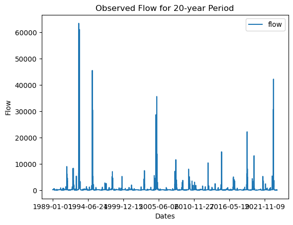
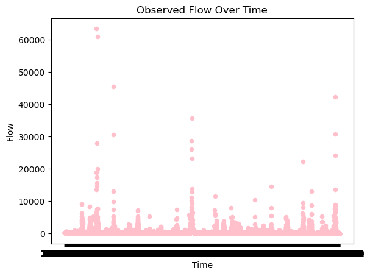
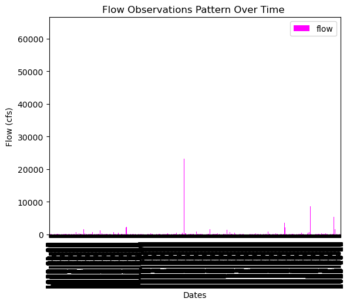
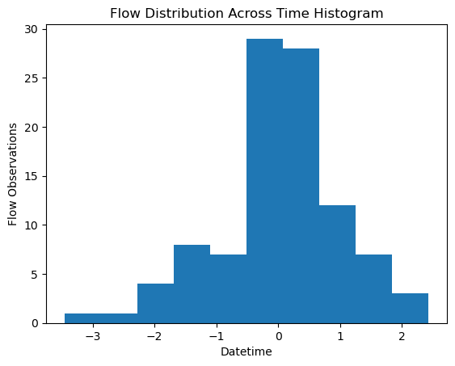
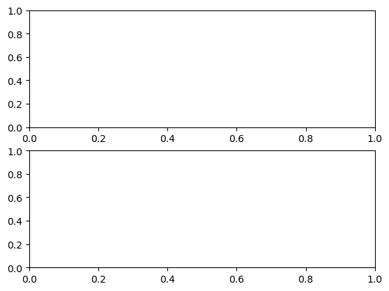

# Assignment: HW Week 7 Matplotlib
## Name: Jason Schlottman
## Date: 10/10/2023

### Forecast Summary:
For this week's forecast I determined 1-week and 2-week forecast esimates of 74.8 cfs and  75.8 cfs. These flow values were determined by analyzing streamgauge data run within a pandas dataframe, resulting in obervations of flow code along with a corresponding datetime. 
I located and selected recent flow values over a 1-week and 2-week out period leading up to the forecast dates, which serve as estimates as these are likely similar and useful as representative flow values that will be observed over the forecast periods.
### Plots with Figures & Descriptions: 
1. Lineplot:
   This figure displays flow observations over a 20 year period with associated date of measurement collection.
   

2. Scatterplot:
   This plot is a scatterplot where measurements of flow are taken across a wide range of dates to determine a representative distribution of flow over time.
   

3. Barplot:
   The barplot provides insight into major flow distributed into representative blocks over periods of time to compare and observe levels of varying streamflow.
   
   
4. Histogram:
   The histogram is especially useful as a simple visual aid in observing the underlying spread of values in the flow dataset. It helps with determining the overall general distribution of flow as time proceeds while able to quickly note peaks, low flow periods, and note potential outliers from the rest of the data.
   
   
5. Multipanel plot:
   This plot intended to compare flow over two distinct time periods across the dates, which may provide insight into interesting distribution or trends for amount of precipitation throughout the year or possibly across much larger time scales. However, I kept messing up my code even more and ended up totally ruining it before I ran out of time to submit the assignment.

   

### Self Reflection on Progress
Although I certainly still may struggle with taking a long time before concepts really click in my brain, I eventually understand them conceptully as well as the basics of aopplying them in practical applications. I do feel as though I'm getting closer to a point where I can say I feel more confident in my knowledge and ability to tackle Python based problem-solving. 
I would say some of my favorite things to learn about involve gaining a better understanding and getting better at identifying common python syntax and formatting and being able to recognize and fix mistakes or errors within a dysfunctional code.I believe that as I gain exposure to a more diverse set of skills as we cover more modules each week, I find they often help build a foundation for each other and reinforce past methods learned before and allow for more practice which is useful. I still have a lot to learn and practice but I'm feeling like I'm improving and doing much better than at the start and simply need to continue practicing.