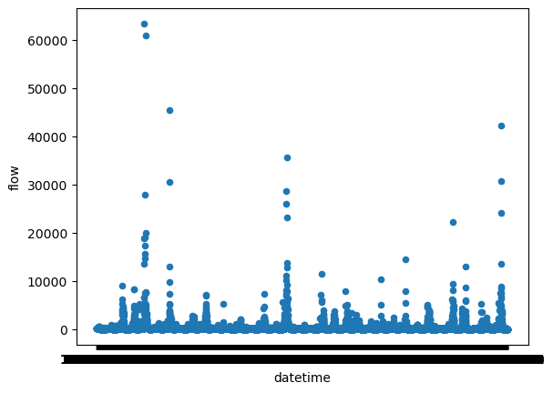

# Assignment: HW 8 Forecast Script
## Author Name: Jason Schlottman
## Date: 10/23/2023

### Grade
2.5/3: Nice job. I subtracted 0.5 because one of your graphs didn't make it in and because you weren't actually using the timeseries functionality. 
- Note that one of your graphs did not come through because there is no image.png in this file. 
- Your understanding of the assignment is correct and I do see that you read in the data using timeseries option. However that was called 'data2' and throughout your code you used 'data' instead and thats why your x-axes are still looking all scrunched up. 
###

### Forecast Summary:
For this week's forecast I determined 1-week and 2-week forecast esimates of 103 cfs and 214 cfs. These values were determined by analyzing flow data from a dataframe as well as the use of for loops, lists, and conditional statements to select dates and value ranges of desired observations within the same month of October in previous years to serve as reasonable comparisons to estimate 1-week and 2-week flow values.

### Graphs:
Histogram showing flow distribution over time from streamguage dataset.

Scatterplot showing distribution of flow measurements collected over time.

### Reflection:
 I think I produced a working script however I am a bit uncertain as to whether I approached this assignment correctly. To my understanding we were prompted to create a script returning forecast estimates within a print statement using any methods we have learned so far as long as it depends on a calculation rather than a simple hard coded number. However I'm not entirely certain whether I incorporated the TimeSeries component correctly or if I needed to use this for each step of calculations. Perhaps I need to reapproach the script and reformat to base off of this timeseries. Hopefully my approach is acceptable and I did not exclude or misinterpret any major requirements. Other than this concern I feel that the class is going fairly well. The content is certainly getting more difficult, but with extra practice and some patience I'm confident I can continue to figure it out and improve a lot more than the level I am currently at as we progress.